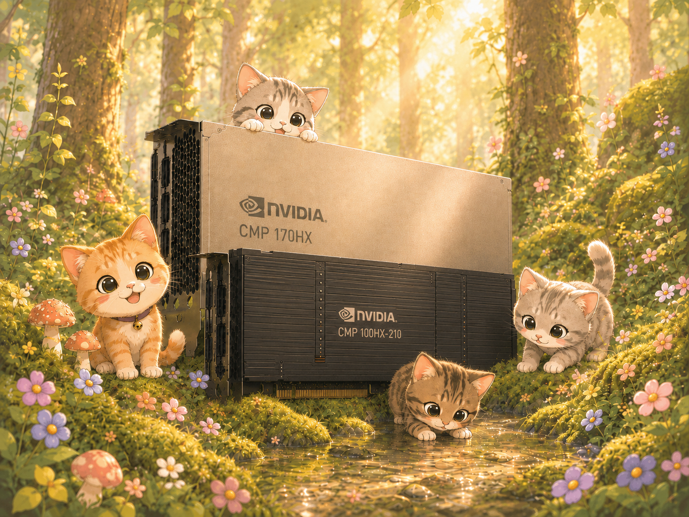
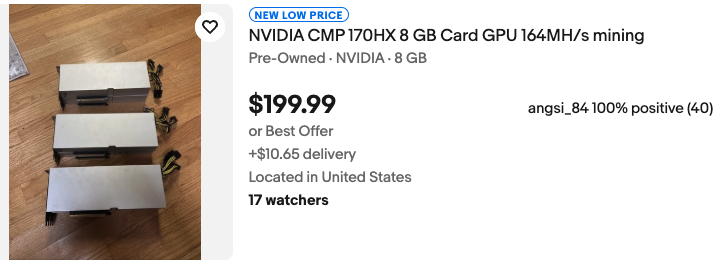
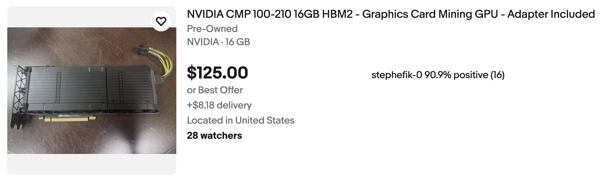

  

<h3 align="center">CMPHX</h3>

  <strong>Condemned to mine crypto. Repurposed for LLM inference.</strong> 
  A community guide and worklog on optimizing NVIDIA CMP HX cards for LLM inference.

> [!CAUTION]
> This repo is a work in progress! Feel free to check in on it frequently for updates.

---

## Quick Start

## TLDR

[NVIDIA CMP HX](https://www.nvidia.com/en-us/cmp/) is a family of GPUs built for mining cryptocurrency. 
In this repo, we focus on two specific cards: the CMP 170HX and the CMP 100HX-210, both of which are derived from repurposed datacenter silicon. 
The CMP 170HX uses the GA100 die found in the NVIDIA A100, while the lesser-known CMP 100HX-210 uses the GV100 die found in the V100.

The catch with these cards is the restrictions that NVIDIA has applied to each of them, resulting in certain capabilities being nerfed relative to the original datacenter cards. 
The two cards are gated differently, and in this project we dive deep into each of them.

What we hope to gain from this project is the strangely fast memory bandwidth provided by each of the cards, strange especially at their price points.
After tuning for each card and running standard llama.cpp benchmarks, we are able to achieve the following for Llama 2 7B (Q4_0):

| Card | base pp512 t/s | base tg128 t/s | optimized pp512 t/s | optimized tg128 t/s | pp512 speedup | tg128 speedup |
| --- | --- | --- | --- | --- | --- | --- |
| CMP 170HX | 614 | 66 | 1304 | 203.8 | 2.12× | 3.09× |
| CMP 100HX-210 | 409 | 112 | 2050 | 124.8 | 5.01× | 1.11× |

For the sake of comparison, here are some other cards that are comparable in decode (token generation) speed.
See [ggml-org/llama.cpp #15013](https://github.com/ggml-org/llama.cpp/discussions/15013) for the full list.

| Card | pp512 t/s | tg128 t/s |
| --- | --- | --- |
| A100 80 GB | 5285.96 ± 6.58 | 200.90 ± 0.12 |
| RTX 3090 | 5560.06 ± 16.28 | 161.89 ± 0.18 |
| RTX 3060 | 2407.67 ± 3.73 | 76.92 ± 0.03 |
| Tesla V100 | 2973.78 ± 3.62 | 134.76 ± 0.02 |

It is clear from the disparity in pp512 numbers that the tradeoff is price for compute/prefill speed. 
The value, however, lies in the remarkable decode speed, enabled by the high memory bandwidth of both cards.
These two cards, priced around (and sometimes even less than) a used RTX 3060 can achieve faster decode speeds at the cost of prefill speed.
Depending on the model (reasoning-heavy), such a tradeoff could be worth it.

## Details

  

## AI Usage

I conducted all experiments and kernel optimizations in collaboration with Claude [Opus 4.7](https://www.anthropic.com/news/claude-opus-4-7), [Opus 4.8](https://www.anthropic.com/news/claude-opus-4-8), and [Fable 5](https://www.anthropic.com/news/claude-fable-5-mythos-5).

I did not use any AI in the writing in this repo (i.e. all writing was done by me). I did use AI to iterate on ideas and key points in my writing.

[GPT Image 2](https://openai.com/index/introducing-chatgpt-images-2-0/) was used to create the banner at the top of this README.

<!--

---

  
   
  <em>The CMP 170HX listed on eBay for ~$200 USD.</em>

  
   
  <em>The CMP 100-210 listed on eBay for ~$125 USD.</em>

## What makes it different?

We can walk through the specs of a GPU in three parts: compute, memory, and everything else. We'll compare the 170HX against A100, as well as the RTX 3090 and the RTX 3060, two beloved cards for local inference.

  
   
  <em>The <a href="https://huggingface.co/hardware?view=table">hardware</a> the Hugging Face community runs local inference on.</em>

### Compute

| | RTX 3060[^5] | RTX 3090[^2] | A100 (PCIe, 40 GB)[^3] | CMP 170HX[^1] |
|---|---|---|---|---|
| CUDA cores | 3,584 | 10,496 | 6,912 | 4,480 |
| Tensor cores | 112 | 328 | 432 | 280 |
| FP16 — tensor¹ | ~25 TFLOP/s | 71 TFLOP/s | 312 TFLOP/s | ~5 TFLOP/s ² |
| FP32 — CUDA cores | 12.7 TFLOP/s | 35.6 TFLOP/s | 19.5 TFLOP/s | 0.39 → 6.25 TFLOP/s ³ |
| BF16 — CUDA cores | 12.7 TFLOP/s | 35.6 TFLOP/s | 39 TFLOP/s | ~6.25 TFLOP/s ⁴ |
| FP16 — CUDA cores | 12.7 TFLOP/s | 35.6 TFLOP/s | 78 TFLOP/s | ~24.5 TFLOP/s ⁵ |

¹ Dense (non-sparse) tensor FP16, FP32-accumulate. The 3090 and 3060 FP16-accumulate rates are double (142 and ~51 TFLOP/s); the A100 has no such split. The 3060 is not in the GA102 whitepaper — its tensor figure is scaled from the GA10x per-Tensor-Core rate, other figures from [^5]. 
² Nominal ~150 TFLOP/s; the firmware gates the tensor path to roughly 1/32, so ~5 is the effective rate. 
³ Fused FP32 (FFMA) is firmware-throttled; compiling with -fmad=false (separate FMUL + FADD) recovers it. 
⁴ GA100 has a packed BF16 path (the A100's 39 = 2× FP32), but a bf16 SIMT GEMM with FP32 accumulate widens to FP32 and runs at the FP32 rate — hence converting GEMMs bf16→fp16. 
⁵ The path the throttle leaves alone (HFMA2). Measured register peak; the GA100 nominal is higher. 
The 3060, 3090, and A100 figures are nominal peaks (whitepapers / vendor specs). The 170HX compute figures are measured on this card[^4] — the throttle makes its nominal spec meaningless.

### Memory

| | RTX 3060[^5] | RTX 3090[^2] | A100 (PCIe, 40 GB)[^3] | CMP 170HX[^1] |
|---|---|---|---|---|
| Bandwidth | 360 GB/s | 936 GB/s | 1,555 GB/s | 1,493 GB/s |
| Capacity | 12 GB GDDR6 | 24 GB GDDR6X | 40 GB HBM2 | 8 GB HBM2e |

### Everything else

| | RTX 3060[^5] | RTX 3090[^2] | A100 (PCIe, 40 GB)[^3] | CMP 170HX[^1] |
|---|---|---|---|---|
| PCIe¹ | 4.0 ×16 (~32 GB/s) | 4.0 ×16 (~32 GB/s) | 4.0 ×16 (~32 GB/s) | 1.0 ×4 (~1 GB/s) |
| TDP | 170 W | 350 W | 250 W | 250 W ² |

¹ One-directional. The 170HX's Gen1 ×4 is firmware-locked. 
² Rated 250 W; the FMA power limiter holds real draw to ~80–115 W.

## Acknowledgements

## References

[^1]: NVIDIA CMP 170HX 8 GB — specifications. TechPowerUp GPU Database. <https://www.techpowerup.com/gpu-specs/cmp-170hx-8-gb.c3830>
[^2]: *NVIDIA Ampere GA102 GPU Architecture* whitepaper, v2 — RTX 3090 specifications in Appendix A (Table 9). NVIDIA, 2020. <https://www.nvidia.com/content/PDF/nvidia-ampere-ga-102-gpu-architecture-whitepaper-v2.pdf>
[^3]: *NVIDIA A100 Tensor Core GPU Architecture* whitepaper — A100 specifications in Table 4 (GA100). NVIDIA, 2020. <https://images.nvidia.com/aem-dam/en-zz/Solutions/data-center/nvidia-ampere-architecture-whitepaper.pdf>
[^4]: Measured on this card via the microbenchmarks in `benchmarks/`. No vendor profiler runs on the 170HX, so figures are wall-clock A/B and register-resident peaks.
[^5]: NVIDIA GeForce RTX 3060 12 GB — specifications. TechPowerUp GPU Database. <https://www.techpowerup.com/gpu-specs/geforce-rtx-3060.c3682>

-->
